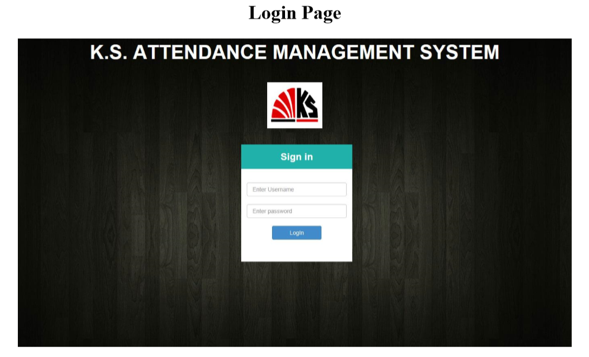
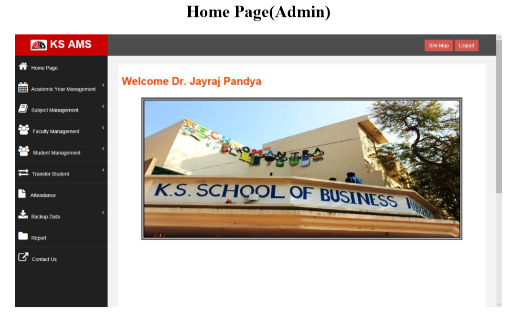
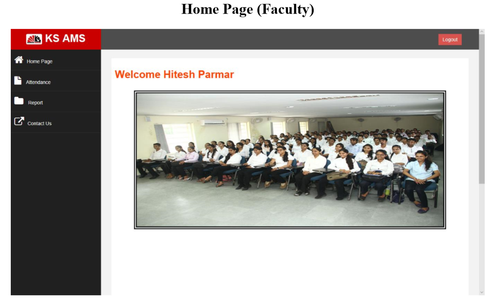
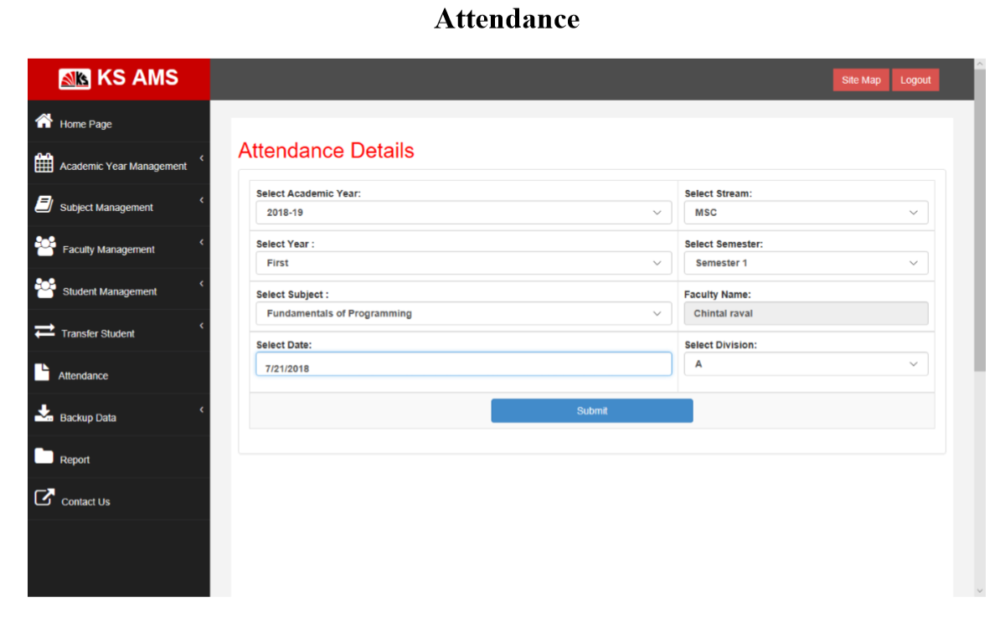
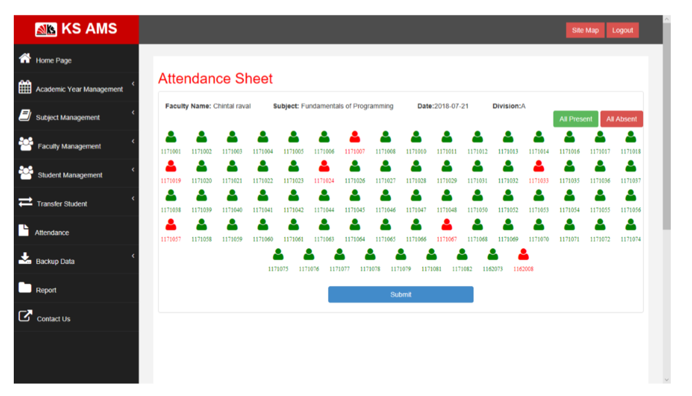
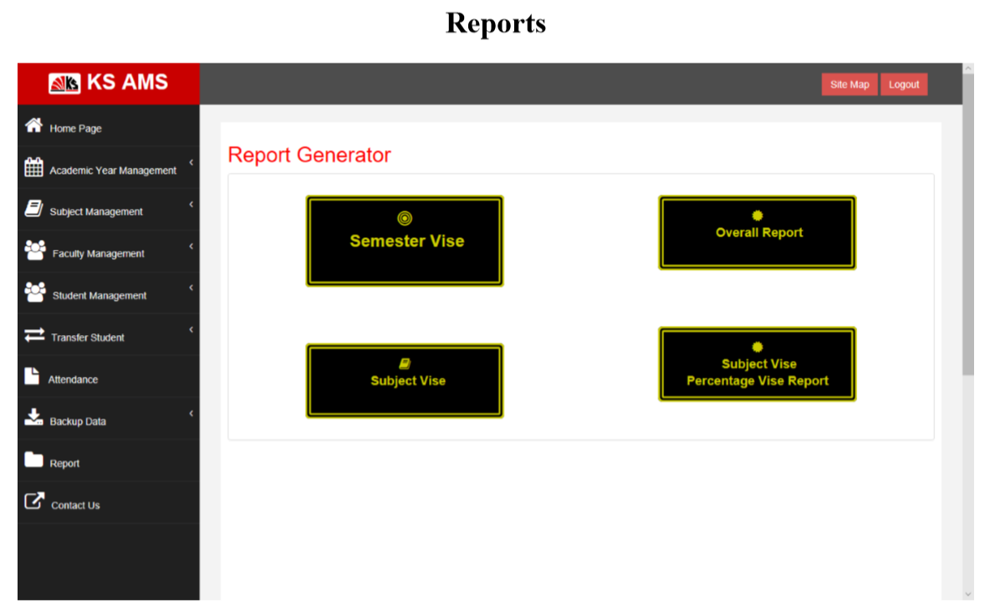

# Attendance-Management-System
The KS AMS is the Web Application, which is used for manage the attendance of the students. It also generates different types of reports from the attendance data.  
This system manages students, faculties, subjects and attendance of the students. It also provides functionality of taking backup of student data as well as attendance data in Excel file and transferring students from current semester to next semester and from current year to next year. The system generates reports like student vise monthly report of each and every subject, subject vise report of the particular class, semester vise report of a particular student and a report which help for shortlisting the students on the base of percentage range of total attendance.

Database of this system is in root folder. kindly gave the name of database "sams".
<h1> Screen shots of system </h1>

